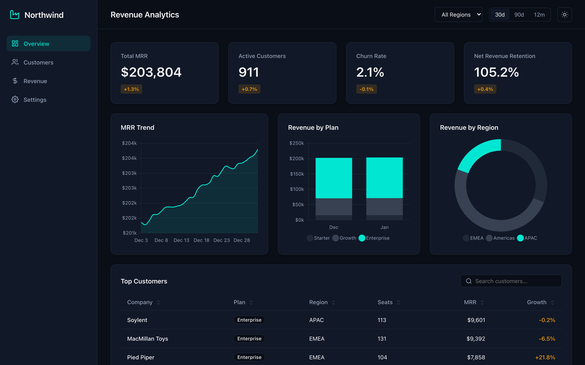

# deiza-mapper

[](https://pypi.org/project/deiza-mapper/)
[](https://github.com/marcosdeaza/deiza-mapper/actions/workflows/ci.yml)
[](https://opensource.org/licenses/MIT)


HTML-first output engine for language-model code and prose. One rendering pipeline (headless Chromium, DOM extraction, native Office writers) turns what a model writes into two families of deliverables:

- **Interactive web apps and bundles**: a file list emitted by a model (`index.html`, stylesheets, ES modules, assets) becomes a self-contained single-file HTML page, a `.zip` project and a smoke-test report. The page runs in headless Chromium from a real origin; console errors, uncaught exceptions, a screenshot and the rendered text come back, so an agent can verify and repair its own app before handing it over.
- **Designed documents and decks**: Markdown, semantic HTML or a JSON plan becomes an editorial PDF (paged CSS, KaTeX, Chart.js, Mermaid), an editable PowerPoint deck (native text boxes, vector shapes, gradients, pictures, tables, PNG previews) or a Word document with native OMML equations. Twelve slide recipes and ten themes keep every output on one design system.

## Capabilities

| Capability | Web App / Bundle | PDF | PPTX | DOCX |
|:---|:---:|:---:|:---:|:---:|
| Primary input | JSON file list (`[{name, content}]`) or a lone HTML page | Markdown / HTML | HTML slides (recipes) / JSON plan | Markdown / HTML |
| Output | Single-file HTML, `.zip`, smoke-test report + PNG | PDF (A4/Letter, cover, page numbers) | `.pptx` + PNG per slide + landscape PDF | `.docx` |
| Local files | CSS and scripts inlined, ES modules through an import map, SVG as data URI | Remote / local images inlined | Native picture shapes | Native picture shapes |
| Validation | Missing references, invalid JSON, empty files, console and page errors in Chromium | - | Per-slide QA (`fs`, `fill`, overflow, text over picture) | - |
| Text and typography | HTML5 / CSS as written | CSS / Google Fonts | Native runs (font, size, weight, colour, links) | Native paragraphs and runs |
| Layout | The app's own | Paged CSS (`@page`) | 1280x720 recipe slides with proportional autofit | Flow document |
| Theming (10 themes) | - | Yes | Yes | Yes |
| Tables | HTML | Themed HTML tables | Native PowerPoint tables | Native Word tables |
| LaTeX math | KaTeX | KaTeX | Rasterised | Native OMML equations |
| Chart.js / Mermaid | Interactive | Rendered | Rasterised in place | Rasterised in place |
| Runtime storage (`localStorage`, `fetch` of bundle files) | Works: the bundle is served from `http://bundle.local/` | - | - | - |

## Output Preview

| Web App / Interactive Bundle | PowerPoint Slides |
|:---:|:---:|
|  |  |

| PDF Document | Word Document (OMML Math) |
|:---:|:---:|
|  |  |

The dashboard above is `examples/interactive_dashboard.json`: four files written by a model (Chart.js, seeded data, filters, sortable table, theme toggle persisted in `localStorage`), packaged by `runnable_html` and screenshotted by `run_bundle` without any manual edit.

## Installation

```bash
pip install "deiza-mapper[all] @ git+https://github.com/marcosdeaza/deiza-mapper.git"
python -m playwright install --with-deps chromium
```

### Optional Dependency Sets

| Extra | Packages | Purpose |
|:---|:---|:---|
| `[math]` | `mathml2omml>=0.0.2` | Native OMML equation generation for DOCX |
| `[highlight]` | `Pygments>=2.15` | Syntax highlighting in code blocks |
| `[server]` | `Flask>=3.0` | HTTP rendering endpoints (Flask blueprint) |
| `[all]` | `mathml2omml`, `Pygments`, `Flask` | Full feature set |
| `[dev]` | `all` + `pytest>=8`, `pymupdf>=1.24` | Local testing and test suite execution |

## Quickstart

### 1. Render PDF from Markdown

```python
from deiza_mapper import render_pdf

markdown_content = """<!-- theme: editorial numbers: true -->
# Quarterly Performance Analysis

Executive review and financial trajectory for FY2026.

> [!NOTE]
> Net recurring revenue increased by **18.4%** quarter-over-quarter.

```chart
{"type": "bar", "data": {"labels": ["Q1", "Q2", "Q3", "Q4"],
 "datasets": [{"label": "Revenue ($M)", "data": [12.4, 14.8, 17.2, 21.0]}]}}
```

$$
V(t) = V_0 \cdot e^{rt} + \sum_{k=1}^{n} \frac{C_k}{(1 + d)^k}
$$
"""

pdf_bytes = render_pdf(markdown_content, filename="report.pdf")
with open("report.pdf", "wb") as f:
    f.write(pdf_bytes)
```

### 2. Render PowerPoint Deck from HTML Slides

A slide is a **layout recipe** (a class on the section) plus content inside `<div class="pad">`. The design system (`static/deck.css`) owns every measurement, so the model only decides structure and words:

```python
from deiza_mapper import render_deck

slide_html = """<!-- theme: swiss -->
<section class="slide cover">
  <div class="pad">
    <p class="kicker">Launch</p>
    <h1>Vector Engine v2</h1>
    <p class="sub">Distributed semantic indexing at sub-millisecond latencies.</p>
    <p class="meta">September 2026 · Platform team</p>
  </div>
</section>

<section class="slide cards">
  <div class="pad">
    <p class="kicker">Architecture</p>
    <h2>Core specifications</h2>
    <div class="grid-3">
      <div class="card"><div class="idx">01</div><h4>Storage</h4><p>Memory-mapped HNSW graph indices with 8-bit quantization.</p></div>
      <div class="card"><div class="idx">02</div><h4>Throughput</h4><p>145,000 queries per second across a 3-node cluster replica.</p></div>
      <div class="card"><div class="idx">03</div><h4>Recall</h4><p>99.4% recall@10 on 100M 1536-dimensional embedding vectors.</p></div>
    </div>
  </div>
</section>

<section class="slide closing">
  <div class="pad">
    <h1>Available today</h1>
    <p class="sub">Documentation and API keys at api.example.com</p>
  </div>
</section>
"""

result = render_deck(slide_html, pdf=True, previews=True)

with open("presentation.pptx", "wb") as f:
    f.write(result.pptx)

# Optional landscape PDF twin
if result.pdf:
    with open("presentation.pdf", "wb") as f:
        f.write(result.pdf)

# PNG preview of each slide
for idx, png_bytes in enumerate(result.previews, start=1):
    with open(f"slide_{idx:02d}.png", "wb") as f:
        f.write(png_bytes)
```

### 3. Render DOCX with Native OMML Math

```python
from deiza_mapper import render_docx

markdown_doc = """<!-- theme: paper -->
# Technical Specification

System integration standards and compliance criteria for partner platforms.

> [!TIP]
> Use mutual TLS authentication on port 8443 for all inter-service communication.

| Protocol | Version | Transport | Encryption |
|:---|:---|:---|:---|
| gRPC | 1.62 | HTTP/2 | TLS 1.3 |
| REST | 2.1 | HTTP/1.1 | TLS 1.3 |

Authentication token lifetime: $T_{\\text{session}} = \\min(t_{\\text{expiry}}, 3600)$.
"""

docx_bytes = render_docx(markdown_doc)
with open("specification.docx", "wb") as f:
    f.write(docx_bytes)
```

### 4. Package and Smoke-Test an Interactive Web App

```python
import json
from deiza_mapper.bundle import build_zip, run_bundle, runnable_html, validate

# The file list a model emits inside its ```artifact block (type "zip")
project = json.load(open("examples/interactive_dashboard.json"))["files"]
# [{"name": "index.html", "content": "..."}, {"name": "styles.css", ...}, {"name": "data.js", ...}, {"name": "app.js", ...}]

issues = validate(project)            # missing references, invalid JSON, empty files
assert not [i for i in issues if i["level"] == "error"]

# One self-contained page: CSS and scripts inlined, ES modules rewired through an import map
with open("dashboard.html", "w", encoding="utf-8") as f:
    f.write(runnable_html(project))

# The same project as a .zip, ready to unzip and open
with open("dashboard.zip", "wb") as f:
    f.write(build_zip(project))

# Run it in headless Chromium from a real origin, exercise the UI, collect errors and a screenshot
report = run_bundle(project, width=1440, height=900, wait_ms=2000,
                    clicks=['button[data-value="365"]', "#theme-toggle"])
print(report["ok"], report["errors"], report["title"])
with open("dashboard.png", "wb") as f:
    f.write(report["png"])
```

`report["ok"]` is `True` only when the page loaded without uncaught exceptions or console errors. `report["text"]` holds the rendered `innerText` after the clicks, so a caller can assert that a filter changed the numbers on screen.

## Web Bundles and Single-File Apps

`deiza_mapper.bundle` is the runtime for model-written web projects. Every function accepts the raw thing a model produced: a JSON array of `{name, content}`, a `{"files": [...]}` object, a mapping of path to content, a JSON string with broken escapes, `// file: name` separated dumps, or a lone HTML document.

| Function | Purpose |
|:---|:---|
| `parse_files(content) -> list` | Tolerant normalisation into `[{"name", "content"}]`. Paths are normalised (`./`, backslashes, leading `/`). |
| `entry_file(files)` | `index.html` first, then a root-level HTML file, then any HTML file. |
| `runnable_html(files, entry=None) -> str` | One self-contained HTML page. `<link rel="stylesheet">` becomes `<style>`; classic `<script src>` is inlined; scripts with `import`/`export` (or `type="module"`) become `data:text/javascript` modules and every relative import is rewired through a generated `<script type="importmap">` (`@bundle/<path>` keys); SVG assets referenced by `src`/`href` become data URIs. Runs inside a sandboxed `<iframe srcdoc>` or straight from disk. |
| `build_zip(files, root=None) -> bytes` | A real `.zip` of the project (optionally under a root folder). Paths containing `..` are skipped. |
| `validate(files) -> list` | Static issues: `{"level": "error" \| "warn", "msg"}`. Missing HTML entry, references to missing `.css/.js/.svg/.json` files, missing relative ES imports, invalid JSON files, empty files, duplicate names, a canvas without an animation loop. |
| `run_bundle(files, width=1280, height=800, wait_ms=1500, entry=None, screenshot=True, keys=None, clicks=None, scale=1.0, full_page=False) -> dict` | Executes the page in headless Chromium. Returns `{ok, errors, console, title, text, png}`. |
| `detect_kind(files) -> str` | `game` (canvas + animation loop or input handlers), `site` (several pages), `app` (state, fetch or listeners), `page`, `files`. |
| `file_tree(files) -> str` | Compact project map for a model context window: path, size and the functions, classes, rules or title each file declares. |

### How `run_bundle` executes a project

1. `runnable_html` produces the single-file page.
2. Chromium is launched headless (one browser per call, bounded by `DEIZA_MAPPER_CONCURRENCY`).
3. The page is served from `http://bundle.local/index.html` through an in-process route: nothing listens on the network, but the document has a real origin, so `localStorage`, `sessionStorage`, same-origin rules and relative `fetch("data.json")` of bundle files behave as on a static host. (A page loaded from `about:blank` cannot touch `localStorage`; most model-written apps persist a theme or a score.)
4. `console` messages (`error`, `warning`, `log`) and `pageerror` exceptions are collected while the page loads and during `wait_ms`.
5. `keys` are pressed and `clicks` (CSS selectors) are clicked in order, with a short settle after each one, so a filter, a menu or a game input can be exercised.
6. The title, the rendered `innerText` and a PNG screenshot (viewport or `full_page`) are captured. `ok` is `True` only when no error was recorded.

A typical agent loop: generate the project, call `run_bundle`, and if `ok` is `False` send `errors`, `console` and `file_tree(files)` back to the model with the request to fix the code, then run again.


## Built-in Themes

Themes configure palette tokens (`bg`, `ink`, `muted`, `accent`, `accent2`, `surface`, `line`) and font pairings across all output formats.

| Theme | Background | Primary Ink | Accent | Heading Font | Recommended Use Case |
|:---|:---|:---|:---|:---|:---|
| `editorial` | `#F7F3EC` | `#1B1B1F` | `#B5432A` | Playfair Display / Georgia | Long-form reports, research papers, culture |
| `noir` | `#0F0F12` | `#F3F1EC` | `#E9C46A` | Space Grotesk / Arial Black | Technical manifests, developer tools, dark UI |
| `swiss` | `#FFFFFF` | `#111111` | `#E63312` | Archivo / Arial Black | Corporate presentations, consulting, business plans |
| `ocean` | `#F4F8FB` | `#0B1F3A` | `#0E7C86` | Manrope / Calibri | Science, medical, financial data, analytics |
| `forest` | `#F3F5EF` | `#1F2E24` | `#B8860B` | Fraunces / Georgia | Sustainability, climate analysis, agriculture |
| `minimal` | `#FFFFFF` | `#1A1A1A` | `#1A1A1A` | Inter Tight / Calibri | Legal documents, technical specs, concise memos |
| `sunset` | `#FFF8F0` | `#2B1D14` | `#E0562A` | DM Serif Display / Georgia | Marketing campaigns, product launches, events |
| `midnight` | `#101827` | `#EEF2F7` | `#37C5B0` | Sora / Calibri | Cloud infrastructure, cybersecurity, executive decks |
| `paper` | `#FBF7EF` | `#2A2420` | `#8D2F36` | Playfair Display / Georgia | Essays, monographs, briefing memos |
| `brutal` | `#FFFFFF` | `#000000` | `#FF3B00` | Archivo Black / Impact | Product manifestos, keynote posters, bold launches |

Theme directives can be set on the first line of Markdown or HTML content:

```markdown
<!-- theme: ocean accent: #0E7C86 cover: true numbers: true size: letter orientation: landscape -->
```

## Markdown Vocabulary

| Syntax | Description | Supported Targets |
|:---|:---|:---|
| `<!-- theme: X -->` | Theme selection and document options (`cover`, `numbers`, `size`, `orientation`) | PDF, PPTX, DOCX |
| `> [!NOTE]` / `> [!TIP]` / `> [!WARNING]` / `> [!IMPORTANT]` | Styled callout panel with titled banner | PDF, PPTX, DOCX |
| `$inline$` and `$$display$$` | LaTeX mathematical equations (native OMML in DOCX) | PDF, PPTX, DOCX, Bundle |
| ` ```chart ` | Chart.js configuration JSON (`bar`, `line`, `pie`, `doughnut`, `radar`) | PDF, PPTX, DOCX, Bundle |
| ` ```mermaid ` | Mermaid diagram specification (`flowchart`, `sequenceDiagram`, `gantt`, etc.) | PDF, PPTX, DOCX, Bundle |
| `::: columns` ... `:::` | Multi-column text flow | PDF, DOCX |
| `::: box` ... `:::` | Framed content container | PDF, DOCX |
| `[[PAGEBREAK]]` | Explicit page break insertion | PDF, DOCX |
| `` | Remote or local image embedding (adjacent images form a gallery) | PDF, PPTX, DOCX, Bundle |

## API Reference

### `render_pdf`

```python
def render_pdf(
    content: str,
    filename: str = "documento.pdf",
    language: str = "es"
) -> bytes:
```

Renders Markdown or complete HTML (`<!doctype html>`) into PDF bytes using Chromium. Full-page background fills and margins are preserved via `pypdf`.

### `render_docx`

```python
def render_docx(
    content: str,
    language: str = "es"
) -> bytes:
```

Parses Markdown and constructs a `.docx` file using `python-docx`. Converts LaTeX equations to native Office OpenXML Math (`OMML`) via `mathml2omml`.

### `render_deck`

```python
def render_deck(
    source: str | dict,
    images: dict | None = None,
    pdf: bool = False,
    previews: bool = True,
    **kw
) -> DeckResult:
```

Accepts raw HTML slide sections (`<section class="slide">`) or a structured JSON plan dict. Computes layouts in Chromium and maps elements to native PowerPoint shapes, text boxes, and tables.

`sanitize=True` runs model-written HTML through `deck.sanitize_model_deck` first: the model's own `<style>`, inline geometry and unknown classes are dropped, every slide gets a recipe class and a `.pad`, pictures move to their recipe slot (`split-img` / `full-img` with an automatic scrim), photos outside `allowed_images` are removed, list/card/row counts are capped and slide numbers are added. Use it whenever an LLM wrote the slides; leave it off for hand-made decks with their own CSS.

#### Slide recipes

| Recipe | Content inside `.pad` | Notes |
|---|---|---|
| `cover` | `.kicker`, `h1`, `.sub`, `.meta` | Colour field, or a `split-img` / `full-img` picture |
| `section` | `h2`, `.sub` | Divider with an automatic running number |
| `text` | `.kicker`, `h2`, `ul` or `p` | 3-5 bullets, `<b>` lead-ins highlighted |
| `split` | as `text` + `` before the pad | Photo on the right (`split-img left` for the left); text never sits under it |
| `full` | `.kicker`, `h2`, `.sub` + `` | Full-bleed photo with a gradient scrim |
| `cards` | `h2`, `.grid-2/3/4` of `.card` (`.idx`, `h4`, `p`) | Cards may hold `.stat-num` + `.stat-label` |
| `stat` | `.stat-num` + `.stat-label`, or `.stats` row of `.stat` | One giant figure, or three/four |
| `two` | `h2`, `.cols.vs` with two `.col` (`h4`, `ul`) | Comparison |
| `table` | `h2`, `table` | Up to 5 columns / 10 rows |
| `timeline` | `h2`, `.timeline` of `.step` (`.when`, `b`, `p`) | 3-6 steps, `timeline.vertical` available |
| `quote` | `.q`, `.author` | Accent background (`quote.soft` for surface) |
| `closing` | `h1`, `.sub`, `.contact` | Accent background (`closing.soft` for surface) |

Every font size in the recipes is `calc(var(--fs) * Npx)`. After layout, the extractor measures each slide and sets `--fs` per section: a slide whose content overflows the safe area shrinks (down to 0.6), one that fills less than ~70 % of it grows (up to 1.35). The per-slide report is returned in `DeckResult.qa` (`fs`, `fill`, `overflow`, `textOverImage`, `droppedImages`) so a caller can ask the model for a fix round on the few slides that need it.

#### `DeckResult`

```python
@dataclass
class DeckResult:
    html: str                 # Complete generated HTML
    pptx: bytes               # Binary .pptx presentation
    previews: list[bytes]     # PNG screenshot per slide (1280x720)
    pdf: bytes | None         # Optional landscape PDF twin
    slides: int               # Slide count
    titles: list[str]         # Extracted titles per slide
    warnings: list[str]       # Layout warnings or rasterization notes
    qa: list[dict]            # Per-slide autofit / QA report (fs, fill, overflow, textOverImage, droppedImages)
```

### `prompts.protocol`

```python
from deiza_mapper import prompts

prompt_fragment = prompts.protocol(language="en")  # or "es"
```

Generates a system-prompt fragment instructing an LLM how to format output artifacts (` ```artifact ` blocks, themes, metadata, equations, charts).

### `prompts.deck_instructions`

```python
deck_prompt = prompts.deck_instructions(
    language="en",
    theme="midnight",
    image_urls=["https://example.com/img1.jpg"],
    min_slides=8,
    max_slides=12
)
```

Generates the system-prompt rules for emitting recipe slides: the mandatory theme line, the exact DOM of every recipe, word budgets per element, the sequence (cover → section blocks → closing) and the list of photo URLs the model may use. Pair it with `render_deck(..., sanitize=True, allowed_images=image_urls)`.

### `bundle.runnable_html`, `bundle.build_zip`, `bundle.run_bundle`

```python
from deiza_mapper.bundle import build_zip, detect_kind, file_tree, parse_files, run_bundle, runnable_html, validate

files = parse_files(model_output)          # list | dict | JSON string | raw HTML
html = runnable_html(files, entry=None)    # str, '' when no HTML entry exists
zip_bytes = build_zip(files, root=None)    # bytes
issues = validate(files)                   # [{"level": "error" | "warn", "msg": str}]
report = run_bundle(files, width=1280, height=800, wait_ms=1500, entry=None,
                    screenshot=True, keys=["ArrowRight", "Space"], clicks=["#start"],
                    scale=1.0, full_page=False)
# report = {"ok": bool, "errors": [str], "console": [str], "title": str, "text": str, "png": bytes}
```

`runnable_html` never fetches anything: only files present in the list are inlined; external `https://` scripts and stylesheets are left in place and load from their CDN when the page runs. Imports of files that are not in the bundle are reported by `validate` and left untouched in the output.

## Command-Line Interface

The package exposes the `deiza-map` executable:

```bash
# Render markdown to PDF
deiza-map render report.md --to pdf --output report.pdf

# Render markdown to DOCX
deiza-map render report.md --to docx --output report.docx

# Render HTML slides to PPTX with previews and landscape PDF
deiza-map render deck.html --to pptx --pdf --previews ./slide_previews/

# Render structured JSON plan to PPTX
deiza-map render plan.json --to pptx --output presentation.pptx

# Validate, package and smoke-test a web bundle (JSON file list or {"files": [...]})
deiza-map bundle examples/interactive_dashboard.json --zip app.zip --html app.html --run --screenshot app.png

# Extract artifact blocks from LLM raw output text
deiza-map extract model_response.txt
```

`deiza-map bundle` prints the project map (`file_tree`) and every static issue (`error:` / `warn:`), then writes the outputs that were requested: `--zip` the archive, `--html` the single-file page, `--run` executes the page in Chromium and prints `ok` or the list of runtime errors, `--screenshot` saves the PNG taken after the run. The exit is silent on success so the command can be chained in scripts and CI.

## Flask Blueprint

Mount rendering endpoints directly inside any Flask application:

```python
from flask import Flask
from deiza_mapper.server import mapper_blueprint

app = Flask(__name__)
app.register_blueprint(mapper_blueprint(), url_prefix="/api/mapper")
```

### Endpoints

| Method | Path | Request Body | Response |
|:---|:---|:---|:---|
| `GET` | `/api/mapper/themes` | None | JSON map of all 10 theme tokens |
| `POST` | `/api/mapper/pdf` | `{"content": "...", "filename": "...", "language": "es"}` | `application/pdf` |
| `POST` | `/api/mapper/docx` | `{"content": "...", "filename": "...", "language": "es"}` | `application/vnd.openxmlformats-officedocument.wordprocessingml.document` |
| `POST` | `/api/mapper/pptx` | `{"content": "...", "pdf": true, "previews": true, "binary": false}` | JSON `{pptx_b64, pdf_b64, previews_b64, slides, titles}` (or `.pptx` binary if `binary: true`) |
| `POST` | `/api/mapper/zip` | `{"files": [{"name": "index.html", "content": "..."}], "filename": "app.zip"}` | `application/zip` |
| `POST` | `/api/mapper/bundle/run` | `{"files": [...], "screenshot": true, "clicks": [...], "keys": [...]}` | JSON `{ok, errors, console, title, text, issues, png_b64}` |
| `POST` | `/api/mapper/artifacts` | `{"text": "...raw LLM output..."}` | JSON `{artifacts: [...], prose: "..."}` |

`/zip` and `/bundle/run` accept the file list under `files` or `content` (any shape `parse_files` understands). `/bundle/run` returns:

```json
{
  "ok": false,
  "errors": ["ReferenceError: drawBoard is not defined"],
  "console": ["[error] Uncaught ReferenceError: drawBoard is not defined"],
  "title": "Snake",
  "issues": [{"level": "warn", "msg": "canvas without an animation loop"}],
  "png_b64": "iVBORw0KGgo..."
}
```

Pass `"screenshot": false` to skip the PNG, `"keys": ["ArrowRight"]` to press keys and `"clicks": ["#start"]` to click selectors before capture; `width`, `height` and `wait_ms` override the viewport and the settle time. The response also carries `text`, the rendered page text after the run. `content` payloads are capped at `max_content` bytes (4 MB by default).

## Examples

| File | What it shows |
|:---|:---|
| `examples/interactive_dashboard.json` | Four-file SaaS analytics dashboard written by a model (Chart.js, seeded data, range and region filters, sortable table, persisted theme). Source of `docs/web_showcase.png`. |
| `examples/casino_bundle.json` | Multi-file game bundle with `css/` and `js/` folders and a CDN stylesheet framework; every local script is inlined by `runnable_html`. |
| `examples/calculator_bundle.json` | Minimal three-file app (`index.html`, `style.css`, `app.js`) with no external dependency, used by the Chromium smoke test in the test suite. |
| `examples/deck.html` | Nine-slide deck written with the recipe vocabulary (cover, section, stat row, full-bleed picture, timeline, table, quote, cards, closing). Source of `docs/slides_grid.png`. |
| `examples/minimal_deck.html` | Three-slide deck: cover, cards, closing. |
| `examples/deck_plan.json` | The structured JSON plan form of a deck. |
| `examples/report.md` | Themed report with cover, callouts, table, Chart.js chart, KaTeX, Mermaid, two-column text and a code block. |
| `examples/minimal_pdf.md`, `examples/minimal_docx.md` | Smallest documents that exercise the PDF and DOCX paths. |

```bash
deiza-map bundle examples/casino_bundle.json --html casino.html --run --screenshot casino.png
deiza-map render examples/deck.html --to pptx --pdf --previews ./slides/
deiza-map render examples/report.md --to pdf
```

## Known Limitations

- **External CDN Dependency**: Chart.js, Mermaid, and KaTeX load from jsdelivr CDN during rendering; an active internet connection is required unless assets are self-hosted. The same applies to any CDN a bundled web app references: `runnable_html` inlines only the files in the bundle.
- **Bundle runtime**: `run_bundle` serves the project from an in-process route; server-side code (Node, PHP, Python) in a bundle is not executed, only static files and the browser runtime.
- **PowerPoint Nested Lists**: Indented list items beyond depth level 1 in HTML slides are flattened to standard bullet runs by `python-pptx`.
- **Word Document Backgrounds**: Full-bleed background colors and CSS gradients are not supported in `.docx` export due to Word document format constraints.
- **Office Font Rendering**: Office formats fallback to standard system typography (e.g., Arial, Georgia, Calibri, Consolas) when specific Google Fonts are not installed locally on the opening machine.

## License

MIT License. Copyright 2026 Marcos de Aza.
