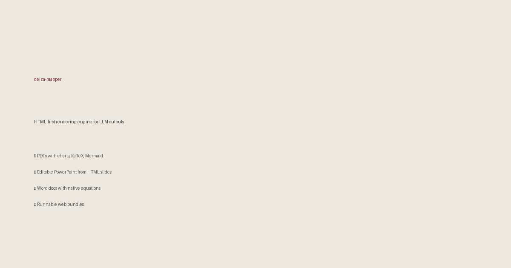
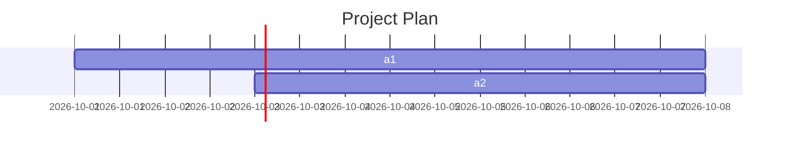

# deiza-mapper

HTML-first rendering engine for LLM outputs. Map model-generated markdown and HTML to real deliverables: designed PDFs, editable PowerPoint slides, Word documents with native equations, and runnable web bundles.

[](https://badge.fury.io/py/deiza-mapper)
[](https://opensource.org/licenses/MIT)



## Why HTML-first?

Office automation libraries (python-pptx, python-docx) force you to reason in low-level primitives: shapes, paragraphs, runs. Navigation libraries donate you to the browser. Deiza-mapper meets in the middle:

1. The LLM writes **semantic HTML** (sections, headings, charts, tables)
2. **Chromium** renders the layout with full CSS support
3. The DOM tree is **extracted and mapped** to native Office elements

This means the model can design slides by writing HTML+CSS, and the resulting `.pptx` contains real text boxes (not screenshots), native tables, gradients, shadows, and images. What cannot be expressed in Office (SVG, canvas, complex filters) is rasterized in-place.

## Features

- **PDFs** with charts (Chart.js), diagrams (Mermaid), equations (KaTeX), callouts, two-column layouts
- **PowerPoint** from HTML slides: native text boxes, shapes, pictures, tables; PNG previews; landscape PDF twin
- **Word documents** with native OMML equations, tables, callout panels, images
- **Web bundles**: runnable single-file HTML app with inlined CSS/JS
- **10 themes** (editorial, noir, swiss, ocean, forest, minimal, sunset, midnight, paper, brutal)
- **Blueprint** for Flask and **CLI** for local rendering

## Installation

```bash
pip install git+https://github.com/marcosdeaza/deiza-mapper
python -m playwright install chromium
```

For equation support in Word:

```bash
pip install deiza-mapper[math]
```

## Quickstart

```python
from deiza_mapper import render_pdf, render_docx, render_deck, prompts

# PDF from markdown
pdf_path = render_pdf("""
<!-- theme: ocean numbers: true -->
# Quarterly Report

## Executive Summary

Key metrics and trends for Q3 2026.

$$\\sum_{i=1}^{n} x_i = \\bar{x}$$

```chart
{"type": "bar", "data": {"labels": ["Q1", "Q2", "Q3"], "datasets": [{"label": "Revenue (M€)", "data": [12, 15, 18]}]}}
```

> [!TIP]
> This callout renders as a highlighted panel.
""", filename="report.pdf")

# DOCX from markdown
docx_path = render_docx("""
<!-- theme: editorial -->
# Proposal

## Timeline


""", filename="proposal.docx")

# Deck from HTML slides
deck = render_deck("""
<!-- theme: midnight -->
<style>
  .slide { background: linear-gradient(135deg, #0f172a 0%, #1e293b 100%); }
  .slide h1 { color: #e2e8f0; font-size: 64px; }
</style>

<section class="slide">
  <h1>Strategy 2027</h1>
  <p>Executive roadmap for growth.</p>
</section>

<section class="slide">
  <h2>Key Metrics</h2>
  <div class="grid-3">
    <div class="card"><div class="n">+38%</div><p>Growth YoY</p></div>
    <div class="card"><div class="n">€12.4M</div><p>Revenue</p></div>
    <div class="card"><div class="n">94%</div><p>Retention</p></div>
  </div>
</section>
""", filename="strategy.pptx")

print(f"PPTX: {deck.pptx}")
print(f"Previews: {deck.previews}")
print(f"PDF: {deck.pdf}")
```

## Protocol

Deiza-mapper defines a structured format for LLM outputs that maps directly to rendered artifacts. Include `prompts.protocol('en')` or `prompts.protocol('es')` in your system prompt.

```python
from deiza_mapper import prompts

system_instruction = prompts.protocol('en') + """
Write the report in the user's language.
"""
```

### Markdown vocabulary

| Element | Syntax | Notes |
|---------|--------|-------|
| Theme | `<!-- theme: ocean numbers: true size: letter orientation: landscape -->` | First line |
| Cover | `<!-- cover: true -->` | Title page with background |
| Callouts | `> [!NOTE]\n> Content` | NOTE, TIP, WARNING, IMPORTANT |
| Equations | `$inline$` and `$$display$$` | LaTeX, native in DOCX |
| Charts | ` ```chart\n{JSON}\n``` ` | Chart.js config |
| Diagrams | ` ```mermaid\n...\n``` ` | Flowcharts, sequences, Gantt |
| Columns | `::: columns\n...\n:::` | Two-column layout |
| Panels | `::: box\n...\n:::` | Framed box |
| Page break | `[[PAGEBREAK]]` | Manual split |

### Deck vocabulary

Slides are HTML `<section class="slide">` elements with 1280x720 layout. Each deck starts with the theme comment and optional `<style>` block.

| Concept | Implementation |
|---------|----------------|
| Slide | `<section class="slide">...</section>` |
| Classes | `.pad` (content wrapper), `.kicker` (label), `.grid-3` (3-column), `.card` (card) |
| Backgrounds | CSS gradients, images, colors |
| Text | `h1`, `h2`, `h3`, `p`, `.sub` |
| Images | `` (inlined server-side) |
| Native (PPTX) | Text boxes runs, shapes gradients, images, tables |
| Rasterized | SVG, canvas, KaTeX, complex filters |

## Themes

10 built-in themes with distinct palettes and typography:

| Theme | Palette | Use case |
|-------|---------|----------|
| editorial | warm serif, cream | Long-form articles |
| noir | dark mode, high contrast | Technical manifests |
| swiss | sans-serif, grid | Modern presentations |
| ocean | light blue, teal accents | Business reports |
| forest | green, earth tones | Environmental docs |
| minimal | grayscale | Clean, minimal |
| sunset | warm oranges, pinks | Creative decks |
| midnight | dark blue, teal | Strategy decks |
| paper | warm, personal | Essays, one-pagers |
| brutal | bold, poster-style | Manifestos |

## Flask Blueprint

Mount the rendering endpoints in your Flask app:

```python
from flask import Flask
from deiza_mapper import mapper_blueprint

app = Flask(__name__)
app.register_blueprint(mapper_blueprint(), url_prefix='/api/mapper')

# Endpoints:
# POST /api/mapper/pdf   -> {"content": "...", "filename": "x.pdf"}
# POST /api/mapper/docx  -> {"content": "...", "filename": "x.docx"}
# POST /api/mapper/pptx  -> {"content": "...", "filename": "x.pptx"}
# POST /api/mapper/zip   -> {"files": [...], "filename": "x.zip"}
```

## CLI

```bash
deiza-map render input.md --theme ocean --output report.pdf
deiza-map render deck.html --output slides.pptx
deiza-map bundle app.json --output bundle.zip --run
```

## How it works

1. **Parse**: Markdown → HTML with extended syntax (callouts, charts, mermaid, math)
2. **Theme**: Apply theme colors, fonts, layout to HTML
3. **Render**: Chromium headless generates pixel-perfect output
4. **Extract**: JS extractor parses DOM into structured representation
5. **Build**: python-pptx / python-docx constructs native Office file
6. **Rasterize**: Elements that can't be expressed natively become PNG

## Limitations

- **Network**: Chart.js, Mermaid, KaTeX load from jsdelivr CDN; without network they won't render (could vendorize)
- **Nested lists**: In PPTX, indentation levels >1 may need manual adjustment
- **Backgrounds**: DOCX doesn't export CSS background images or gradients
- **Performance**: PDF ~2s, DOCX ~2s, deck 7-9 slides ~4s (Mac); VPS ~1.5-2x slower
- **Fonts**: Office-safe fonts used by default (`keep_web_fonts=False`)

## Built for Deiza

Deiza-mapper is the rendering engine behind [Deiza](https://deiza.org), a multi-agent AI assistant for professional document generation.

## License

MIT License. Copyright 2026 Marcos de Aza.
