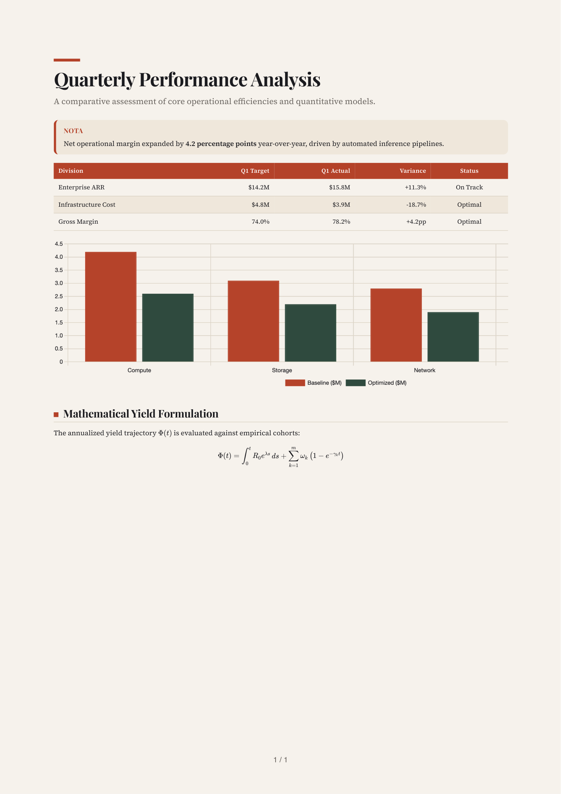
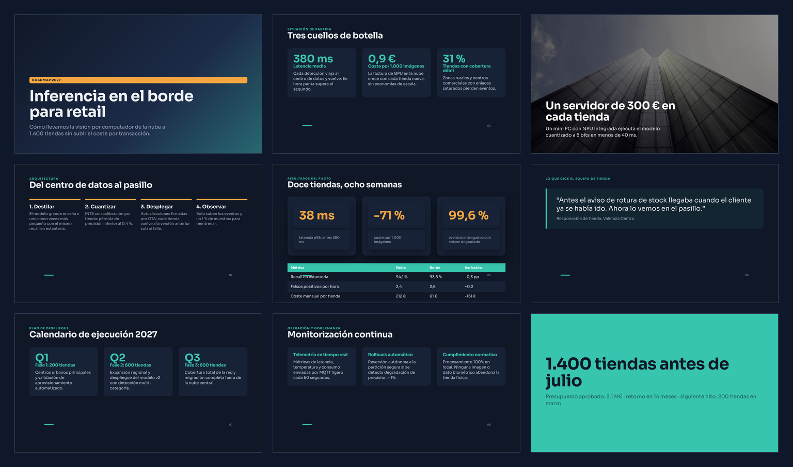
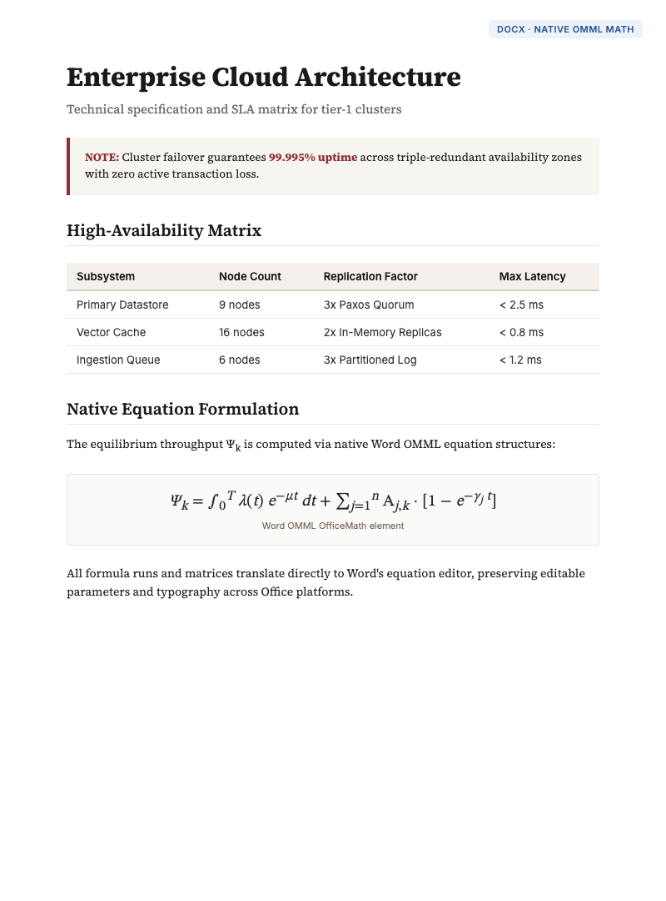

# deiza-mapper

[](https://pypi.org/project/deiza-mapper/)
[](https://github.com/marcosdeaza/deiza-mapper/actions/workflows/ci.yml)
[](https://opensource.org/licenses/MIT)


HTML-first rendering engine for LLM outputs. Converts Markdown, semantic HTML, and structured plans into production-ready PDFs, native editable PowerPoint decks, Word documents with native equations, and self-contained web bundles.

## Capabilities

| Capability | PDF | PPTX | DOCX | Web Bundle |
|:---|:---:|:---:|:---:|:---:|
| Primary Input | Markdown / HTML | HTML slides / JSON plan | Markdown / HTML | JSON file list |
| Text and Typography | CSS / Google Fonts | Native text boxes and runs | Native paragraphs and runs | HTML5 / CSS |
| Layout System | Paged CSS (@page) | 1280x720 flex/grid slides | Flow document layout | Responsive web |
| Theming (10 themes) | Yes | Yes | Yes | Yes |
| Tables | Themed HTML tables | Native PowerPoint tables | Native Word tables | HTML tables |
| Callouts (`> [!NOTE]`) | Highlighted panels | Card containers | Bordered callout boxes | Styled containers |
| LaTeX Math Equations | KaTeX | Rasterized image | Native OMML equations | KaTeX |
| Chart.js Charts | Rendered canvas | In-place rasterization | In-place rasterization | Interactive canvas |
| Mermaid Diagrams | SVG vector | In-place rasterization | In-place rasterization | Interactive SVG |
| Multi-column Sections | `::: columns` | `.grid-2`, `.grid-3`, `.grid-4` | `::: columns` | Flex / Grid |
| Images | Remote / local inlined | Native picture shapes | Native picture shapes | Inlined / Data URI |
| Additional Outputs | Landscape PDF twin | PNG slide previews | - | ZIP / Smoke test |

## Output Preview

| PDF Document | PowerPoint Slides | Word Document (OMML Math) |
|:---:|:---:|:---:|
|  |  |  |

## Installation

```bash
pip install "deiza-mapper[all] @ git+https://github.com/marcosdeaza/deiza-mapper.git"
python -m playwright install --with-deps chromium
```

### Optional Dependency Sets

| Extra | Packages | Purpose |
|:---|:---|:---|
| `[math]` | `mathml2omml>=0.0.2` | Native OMML equation generation for DOCX |
| `[highlight]` | `Pygments>=2.15` | Syntax highlighting in code blocks |
| `[server]` | `Flask>=3.0` | HTTP rendering endpoints (Flask blueprint) |
| `[all]` | `mathml2omml`, `Pygments`, `Flask` | Full feature set |
| `[dev]` | `all` + `pytest>=8`, `pymupdf>=1.24` | Local testing and test suite execution |

## Quickstart

### 1. Render PDF from Markdown

```python
from deiza_mapper import render_pdf

markdown_content = """<!-- theme: editorial numbers: true -->
# Quarterly Performance Analysis

Executive review and financial trajectory for FY2026.

> [!NOTE]
> Net recurring revenue increased by **18.4%** quarter-over-quarter.

```chart
{"type": "bar", "data": {"labels": ["Q1", "Q2", "Q3", "Q4"],
 "datasets": [{"label": "Revenue ($M)", "data": [12.4, 14.8, 17.2, 21.0]}]}}
```

$$
V(t) = V_0 \cdot e^{rt} + \sum_{k=1}^{n} \frac{C_k}{(1 + d)^k}
$$
"""

pdf_bytes = render_pdf(markdown_content, filename="report.pdf")
with open("report.pdf", "wb") as f:
    f.write(pdf_bytes)
```

### 2. Render PowerPoint Deck from HTML Slides

```python
from deiza_mapper import render_deck

slide_html = """<!-- theme: swiss -->
<section class="slide" data-layout="hero">
  <div class="pad">
    <span class="pill">Launch</span>
    <h1>Vector Engine v2</h1>
    <p class="sub">Distributed semantic indexing at sub-millisecond latencies.</p>
  </div>
</section>

<section class="slide">
  <div class="pad">
    <p class="kicker">Architecture</p>
    <h2>Core Specifications</h2>
    <div class="grid-3">
      <div class="card">
        <h3>Storage</h3>
        <p>Memory-mapped HNSW graph indices with 8-bit quantization.</p>
      </div>
      <div class="card">
        <h3>Throughput</h3>
        <p>145,000 queries per second across a 3-node cluster replica.</p>
      </div>
      <div class="card">
        <h3>Recall</h3>
        <p>99.4% recall@10 on 100M 1536-dimensional embedding vectors.</p>
      </div>
    </div>
    <div class="foot"><i></i><b>02</b></div>
  </div>
</section>

<section class="slide bg-accent">
  <div class="pad" style="display: flex; flex-direction: column; justify-content: center;">
    <h1>Available Today</h1>
    <p style="font-size: 26px; margin-top: 16px; opacity: 0.9;">Documentation at api.example.com</p>
  </div>
</section>
"""

result = render_deck(slide_html, pdf=True, previews=True)

with open("presentation.pptx", "wb") as f:
    f.write(result.pptx)

# Optional landscape PDF twin
if result.pdf:
    with open("presentation.pdf", "wb") as f:
        f.write(result.pdf)

# PNG preview of each slide
for idx, png_bytes in enumerate(result.previews, start=1):
    with open(f"slide_{idx:02d}.png", "wb") as f:
        f.write(png_bytes)
```

### 3. Render DOCX with Native OMML Math

```python
from deiza_mapper import render_docx

markdown_doc = """<!-- theme: paper -->
# Technical Specification

System integration standards and compliance criteria for partner platforms.

> [!TIP]
> Use mutual TLS authentication on port 8443 for all inter-service communication.

| Protocol | Version | Transport | Encryption |
|:---|:---|:---|:---|
| gRPC | 1.62 | HTTP/2 | TLS 1.3 |
| REST | 2.1 | HTTP/1.1 | TLS 1.3 |

Authentication token lifetime: $T_{\\text{session}} = \\min(t_{\\text{expiry}}, 3600)$.
"""

docx_bytes = render_docx(markdown_doc)
with open("specification.docx", "wb") as f:
    f.write(docx_bytes)
```

## Built-in Themes

Themes configure palette tokens (`bg`, `ink`, `muted`, `accent`, `accent2`, `surface`, `line`) and font pairings across all output formats.

| Theme | Background | Primary Ink | Accent | Heading Font | Recommended Use Case |
|:---|:---|:---|:---|:---|:---|
| `editorial` | `#F7F3EC` | `#1B1B1F` | `#B5432A` | Playfair Display / Georgia | Long-form reports, research papers, culture |
| `noir` | `#0F0F12` | `#F3F1EC` | `#E9C46A` | Space Grotesk / Arial Black | Technical manifests, developer tools, dark UI |
| `swiss` | `#FFFFFF` | `#111111` | `#E63312` | Archivo / Arial Black | Corporate presentations, consulting, business plans |
| `ocean` | `#F4F8FB` | `#0B1F3A` | `#0E7C86` | Manrope / Calibri | Science, medical, financial data, analytics |
| `forest` | `#F3F5EF` | `#1F2E24` | `#B8860B` | Fraunces / Georgia | Sustainability, climate analysis, agriculture |
| `minimal` | `#FFFFFF` | `#1A1A1A` | `#1A1A1A` | Inter Tight / Calibri | Legal documents, technical specs, concise memos |
| `sunset` | `#FFF8F0` | `#2B1D14` | `#E0562A` | DM Serif Display / Georgia | Marketing campaigns, product launches, events |
| `midnight` | `#101827` | `#EEF2F7` | `#37C5B0` | Sora / Calibri | Cloud infrastructure, cybersecurity, executive decks |
| `paper` | `#FBF7EF` | `#2A2420` | `#8D2F36` | Playfair Display / Georgia | Essays, monographs, briefing memos |
| `brutal` | `#FFFFFF` | `#000000` | `#FF3B00` | Archivo Black / Impact | Product manifestos, keynote posters, bold launches |

Theme directives can be set on the first line of Markdown or HTML content:

```markdown
<!-- theme: ocean accent: #0E7C86 cover: true numbers: true size: letter orientation: landscape -->
```

## Markdown Vocabulary

| Syntax | Description | Supported Targets |
|:---|:---|:---|
| `<!-- theme: X -->` | Theme selection and document options (`cover`, `numbers`, `size`, `orientation`) | PDF, PPTX, DOCX |
| `> [!NOTE]` / `> [!TIP]` / `> [!WARNING]` / `> [!IMPORTANT]` | Styled callout panel with titled banner | PDF, PPTX, DOCX |
| `$inline$` and `$$display$$` | LaTeX mathematical equations (native OMML in DOCX) | PDF, PPTX, DOCX, Bundle |
| ` ```chart ` | Chart.js configuration JSON (`bar`, `line`, `pie`, `doughnut`, `radar`) | PDF, PPTX, DOCX, Bundle |
| ` ```mermaid ` | Mermaid diagram specification (`flowchart`, `sequenceDiagram`, `gantt`, etc.) | PDF, PPTX, DOCX, Bundle |
| `::: columns` ... `:::` | Multi-column text flow | PDF, DOCX |
| `::: box` ... `:::` | Framed content container | PDF, DOCX |
| `[[PAGEBREAK]]` | Explicit page break insertion | PDF, DOCX |
| `` | Remote or local image embedding (adjacent images form a gallery) | PDF, PPTX, DOCX, Bundle |

## API Reference

### `render_pdf`

```python
def render_pdf(
    content: str,
    filename: str = "documento.pdf",
    language: str = "es"
) -> bytes:
```

Renders Markdown or complete HTML (`<!doctype html>`) into PDF bytes using Chromium. Full-page background fills and margins are preserved via `pypdf`.

### `render_docx`

```python
def render_docx(
    content: str,
    language: str = "es"
) -> bytes:
```

Parses Markdown and constructs a `.docx` file using `python-docx`. Converts LaTeX equations to native Office OpenXML Math (`OMML`) via `mathml2omml`.

### `render_deck`

```python
def render_deck(
    source: str | dict,
    images: dict | None = None,
    pdf: bool = False,
    previews: bool = True,
    **kw
) -> DeckResult:
```

Accepts raw HTML slide sections (`<section class="slide">`) or a structured JSON plan dict. Computes layouts in Chromium and maps elements to native PowerPoint shapes, text boxes, and tables.

#### `DeckResult`

```python
@dataclass
class DeckResult:
    html: str                 # Complete generated HTML
    pptx: bytes               # Binary .pptx presentation
    previews: list[bytes]     # PNG screenshot per slide (1280x720)
    pdf: bytes | None         # Optional landscape PDF twin
    slides: int               # Slide count
    titles: list[str]         # Extracted titles per slide
    warnings: list[str]       # Layout warnings or rasterization notes
```

### `prompts.protocol`

```python
from deiza_mapper import prompts

prompt_fragment = prompts.protocol(language="en")  # or "es"
```

Generates a system-prompt fragment instructing an LLM how to format output artifacts (` ```artifact ` blocks, themes, metadata, equations, charts).

### `prompts.deck_instructions`

```python
deck_prompt = prompts.deck_instructions(
    language="en",
    theme="midnight",
    image_urls=["https://example.com/img1.jpg"],
    min_slides=8,
    max_slides=12
)
```

Generates system-prompt rules for emitting `<section class="slide">` HTML slides with layout guidelines and CSS utility classes.

## Command-Line Interface

The package exposes the `deiza-map` executable:

```bash
# Render markdown to PDF
deiza-map render report.md --to pdf --output report.pdf

# Render markdown to DOCX
deiza-map render report.md --to docx --output report.docx

# Render HTML slides to PPTX with previews and landscape PDF
deiza-map render deck.html --to pptx --pdf --previews ./slide_previews/

# Render structured JSON plan to PPTX
deiza-map render plan.json --to pptx --output presentation.pptx

# Validate, package and smoke-test web bundle
deiza-map bundle project.json --zip app.zip --html app.html --run --screenshot test.png

# Extract artifact blocks from LLM raw output text
deiza-map extract model_response.txt
```

## Flask Blueprint

Mount rendering endpoints directly inside any Flask application:

```python
from flask import Flask
from deiza_mapper.server import mapper_blueprint

app = Flask(__name__)
app.register_blueprint(mapper_blueprint(), url_prefix="/api/mapper")
```

### Endpoints

| Method | Path | Request Body | Response |
|:---|:---|:---|:---|
| `GET` | `/api/mapper/themes` | None | JSON map of all 10 theme tokens |
| `POST` | `/api/mapper/pdf` | `{"content": "...", "filename": "...", "language": "es"}` | `application/pdf` |
| `POST` | `/api/mapper/docx` | `{"content": "...", "filename": "...", "language": "es"}` | `application/vnd.openxmlformats-officedocument.wordprocessingml.document` |
| `POST` | `/api/mapper/pptx` | `{"content": "...", "pdf": true, "previews": true, "binary": false}` | JSON `{pptx_b64, pdf_b64, previews_b64, slides, titles}` (or `.pptx` binary if `binary: true`) |
| `POST` | `/api/mapper/zip` | `{"files": [{"name": "index.html", "content": "..."}], "filename": "app.zip"}` | `application/zip` |
| `POST` | `/api/mapper/bundle/run` | `{"files": [...], "screenshot": true}` | JSON `{ok, errors, console, title, png_b64, issues}` |
| `POST` | `/api/mapper/artifacts` | `{"text": "...raw LLM output..."}` | JSON `{artifacts: [...], prose: "..."}` |

## Known Limitations

- **External CDN Dependency**: Chart.js, Mermaid, and KaTeX load from jsdelivr CDN during rendering; an active internet connection is required unless assets are self-hosted.
- **PowerPoint Nested Lists**: Indented list items beyond depth level 1 in HTML slides are flattened to standard bullet runs by `python-pptx`.
- **Word Document Backgrounds**: Full-bleed background colors and CSS gradients are not supported in `.docx` export due to Word document format constraints.
- **Office Font Rendering**: Office formats fallback to standard system typography (e.g., Arial, Georgia, Calibri, Consolas) when specific Google Fonts are not installed locally on the opening machine.

## License

MIT License. Copyright 2026 Marcos de Aza.
