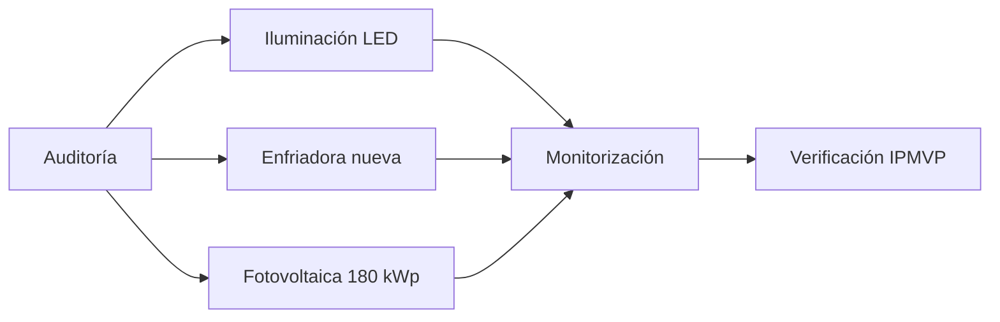

<!-- theme: ocean cover: true numbers: true -->
# Informe de eficiencia energética 2026

Diagnóstico, comparativa de tecnologías y plan de inversión a tres años para un edificio de oficinas de 4.200 m².

## Resumen ejecutivo

El consumo anual del edificio es de **612 MWh**, un 31 % por encima de la referencia del sector para su categoría. Tres medidas concentran el 80 % del ahorro alcanzable: la sustitución de la enfriadora, la iluminación LED con control por presencia y la instalación de 180 kWp fotovoltaicos en cubierta.

> [!IMPORTANT]
> Con el paquete completo, el periodo de retorno ponderado queda en **4,8 años** y las emisiones bajan un 44 %.

## Consumo por uso

| Uso | MWh/año | Peso | Referencia sector |
|---|---:|---:|---:|
| Climatización | 268 | 44 % | 32 % |
| Iluminación | 141 | 23 % | 18 % |
| Equipos ofimáticos | 122 | 20 % | 27 % |
| Otros | 81 | 13 % | 23 % |

```chart
{"type": "bar", "data": {"labels": ["Climatización", "Iluminación", "Ofimática", "Otros"],
 "datasets": [{"label": "Edificio (MWh)", "data": [268, 141, 122, 81]},
              {"label": "Referencia sector (MWh)", "data": [196, 110, 165, 141]}]},
 "options": {"plugins": {"legend": {"position": "bottom"}}}}
```

## Modelo de cálculo

El ahorro anual de cada medida se estima como la diferencia entre el consumo actual y el consumo esperado, descontando el efecto rebote:

$$
A_i = (C_{\text{actual}} - C_{\text{esperado},i}) \cdot (1 - r_i), \qquad r_i \in [0{,}05,\; 0{,}15]
$$

El valor actual neto del paquete se obtiene con la fórmula habitual, donde $t$ es el año y $k$ la tasa de descuento del 6 %:

$$
\mathrm{VAN} = -I_0 + \sum_{t=1}^{n} \frac{A_t}{(1+k)^t}
$$

La matriz de sensibilidad relaciona el precio de la energía con la tasa de descuento:

$$
S = \begin{pmatrix} 0{,}92 & 1{,}00 & 1{,}08 \\ 0{,}85 & 0{,}93 & 1{,}01 \\ 0{,}79 & 0{,}86 & 0{,}94 \end{pmatrix}
$$

## Plan de actuación



### Fases

1. **Trimestre 1.** Auditoría de detalle y licitación de la enfriadora.
2. **Trimestre 2.** Sustitución de luminarias por plantas, sin interrumpir la actividad.
3. **Trimestre 3 y 4.** Instalación fotovoltaica y puesta en marcha del sistema de monitorización.

- [x] Auditoría preliminar entregada
- [x] Presupuestos de iluminación recibidos
- [ ] Licencia de obra para la cubierta

> [!TIP]
> Las subvenciones autonómicas cubren hasta el 30 % de la inversión fotovoltaica si la solicitud entra antes del cierre del ejercicio.

[[PAGEBREAK]]

## Detalle económico

::: columns
La enfriadora actual, de 2009, trabaja con un EER medio de 2,6. El equipo propuesto alcanza 5,1 en condiciones nominales y 6,3 a carga parcial, que es donde el edificio opera el 70 % de las horas. Solo esta medida reduce el consumo de climatización en 118 MWh anuales.

La iluminación LED con detección de presencia y regulación por luz natural reduce el consumo de este uso un 58 %. El coste unitario por luminaria, instalación incluida, se ha cerrado en 96 € con garantía de siete años.
:::

::: box
**Inversión total:** 486.000 €  ·  **Ahorro anual:** 101.000 €  ·  **Retorno ponderado:** 4,8 años  ·  **CO2 evitado:** 96 t/año
:::

```python
def van(inversion, ahorros, k=0.06):
    return -inversion + sum(a / (1 + k) ** t for t, a in enumerate(ahorros, start=1))

print(round(van(486_000, [101_000] * 12), 0))
```

## Conclusión

El edificio puede situarse por debajo de la referencia del sector en dos ejercicios con una inversión que se paga sola antes del quinto año. La recomendación es ejecutar las tres medidas en el orden propuesto y contratar la verificación independiente desde el primer trimestre.
